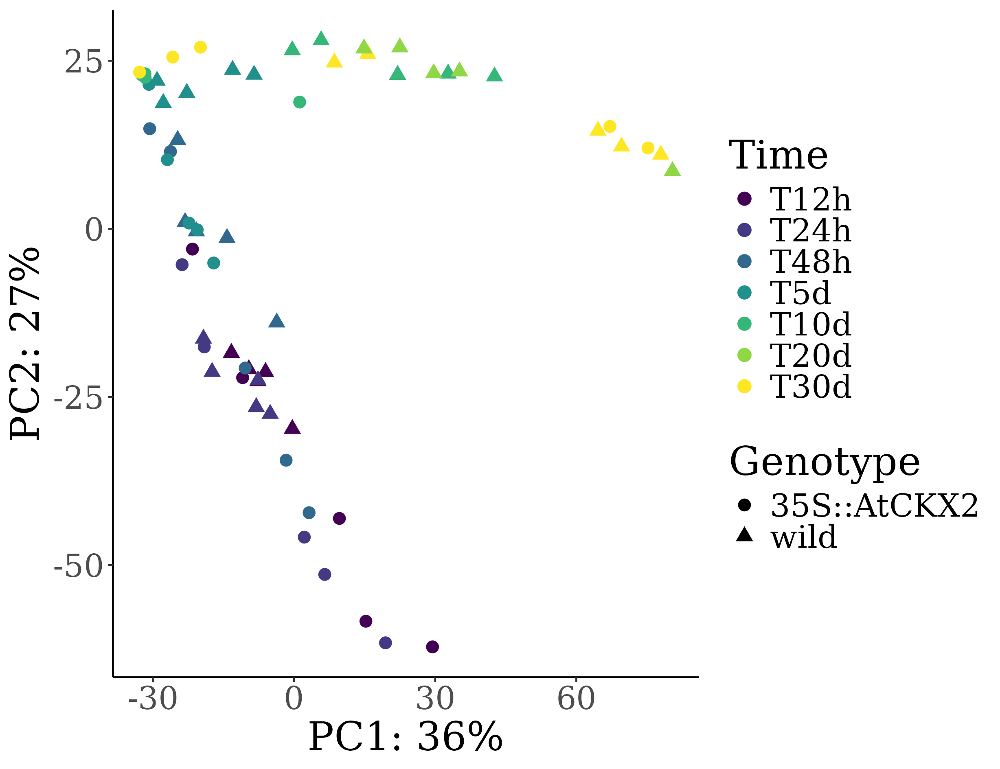
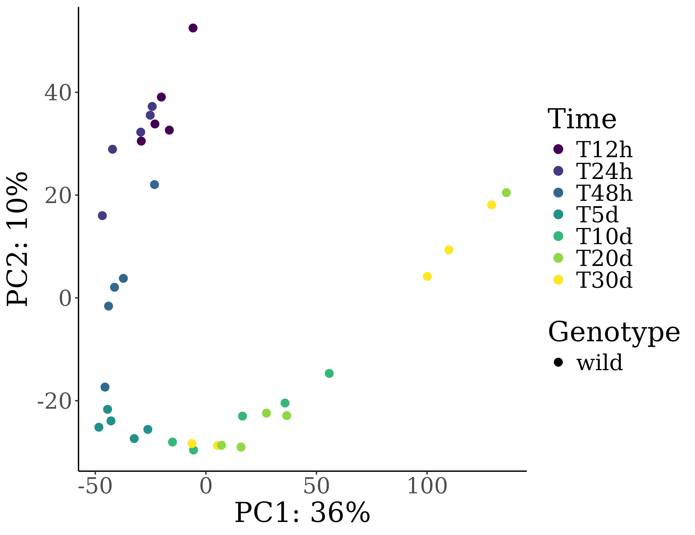
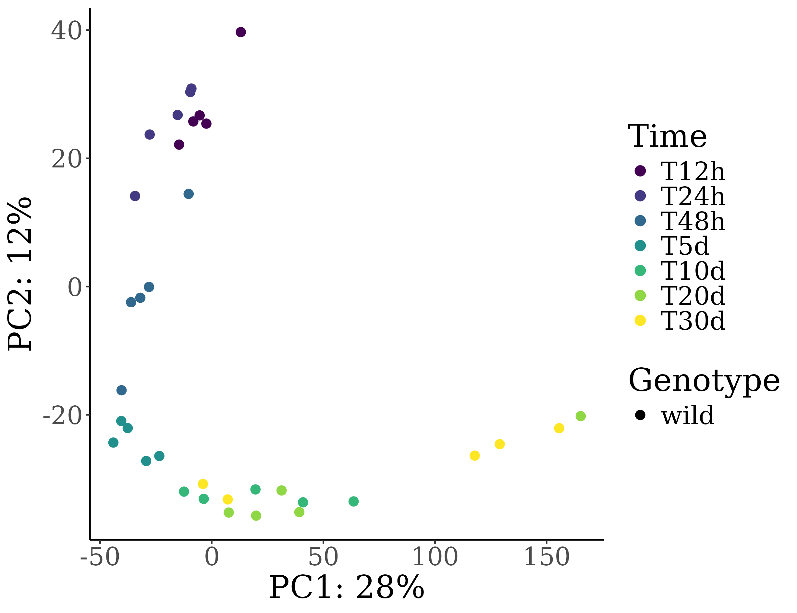
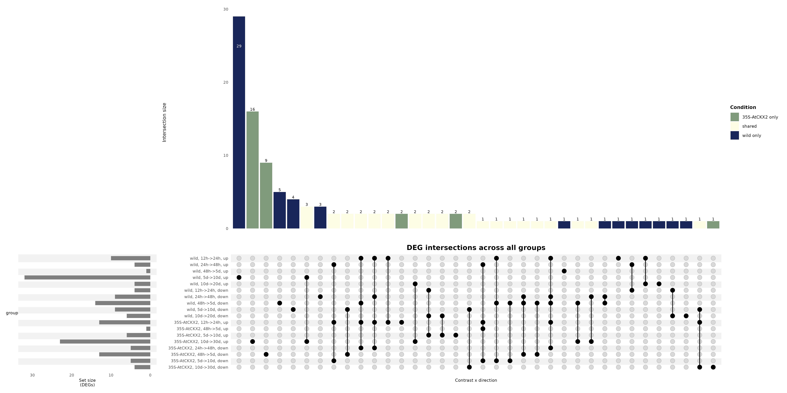

# automatic-fiesta

Repository for the re-analysis of publicly available RNA-seq data from [PRJNA642101](https://www.ncbi.nlm.nih.gov/bioproject/PRJNA642101), focusing on the fungal transcriptomic response.

The pipeline is divided into three main steps:

1. Quality control (QC) and transcript quantification
2. Differential expression analysis (DEA)
3. Functional enrichment analysis (GO)

---

## Reference Genome

The reference genome, transcriptome, proteome, and annotation files correspond to the *M. perniciosa* assembly **MCCS1**, available at the [Cacao Pathogenomics database](https://www.cacaopathogenomics.com/).

---

## 1. Quality Control and Quantification

Raw reads were retrieved from NCBI/SRA using:

- [nf-core/fetchngs v1.12.0](https://nf-co.re/fetchngs/1.12.0/)
- [Nextflow 25.10.4](https://www.nextflow.io/)

Pre-processing and quantification were performed with [nf-core/rnaseq](https://github.com/nf-core/rnaseq), which includes:

- Adapter trimming and low-quality read removal
- Alignment to the reference transcriptome using **STAR**
- Transcript abundance quantification using **Salmon**

> A full interactive quality control report is available at `run1/multiqc/star_salmon/multiqc_report.html` — download the file and open it locally in a browser.

Software versions used in this step are listed in:

- `raw/pipeline_info/nf_core_fetchngs_software_mqc_versions.yml`
- `nf_core_rnaseq_software_mqc_versions.yml`

---

## 2. Differential Expression Analysis

Differential expression was tested with the [DESeq2](https://bioconductor.org/packages/DESeq2/) R package. Comparisons were performed between consecutive time points within each genotype (see `samplesheet.csv` for a complete description of the samples and experimental design).

**Filtering and thresholds applied:**

- Genes with fewer than **1 count in at least 9 samples** were excluded
- Differentially expressed genes (DEGs) were defined as: |log₂ fold change| > 0.5 and adjusted *p*-value < 0.05

**Variance-stabilising transformation (VST)** from DESeq2 was used to explore expression patterns across samples.

### PCA — All samples



### PCA — *35S::AtCKX2* samples



### PCA — Wild-type samples



The PCA plots show highly similar transcriptomic profiles between the two genotypes, with samples grouping consistently by time point in both backgrounds.

---

## 3. DEG Overview — UpSet Plot

The UpSet plot below summarises the number of DEGs per contrast and their overlaps, discriminated by genotype condition (*wild-type* vs. *35S::AtCKX2*) and regulation direction (up- vs. down-regulated).



---

## 4. Functional Enrichment Analysis

Functional annotation was performed with [eggNOG-mapper v2.1.3](https://github.com/eggnogdb/eggnog-mapper).

GO enrichment was tested using the [topGO](https://bioconductor.org/packages/topGO/) R package. Overrepresentation of **Biological Process (BP)** GO terms was assessed separately for up-regulated and down-regulated DEGs in each contrast, using the classic Fisher's exact test followed by Benjamini–Hochberg correction (**FDR < 0.05**).

Results for each contrast are saved in the corresponding subdirectory under:

```
run1/star_salmon/deseq2_qc/<contrast_name>/GO_enrichment/
```

Each subdirectory contains:
- `GO_BP_upregulated.csv` / `GO_BP_downregulated.csv` — enrichment result tables
- `GO_BP_upregulated.png/.pdf/.svg` / `GO_BP_downregulated.png/.pdf/.svg` — dot plots

---

## Repository Structure

```
.
├── samplesheet.csv
├── raw/
│   └── pipeline_info/
│       └── nf_core_fetchngs_software_mqc_versions.yml
├── nf_core_rnaseq_software_mqc_versions.yml
└── run1/
    ├── multiqc/star_salmon/multiqc_report.html
    └── star_salmon/
        └── deseq2_qc/
            ├── PCA_infected_samples.png
            ├── PCA_35S-AtCKX2_infected_samples.png
            ├── PCA_wild_infected_samples.png
            ├── upset_plots/
            │   └── upset_all_contrasts.png
            └── <contrast_name>/
                └── GO_enrichment/
                    ├── GO_BP_upregulated.csv
                    ├── GO_BP_downregulated.csv
                    └── *.png / *.pdf / *.svg
```
